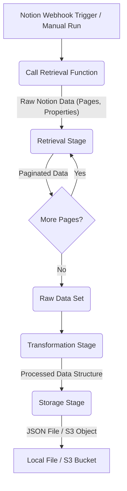

```mermaid
  graph TD
    A[Notion Webhook Trigger / Manual Run] --> B(Call Retrieval Function)
    B -- Raw Notion Data (Pages, Properties) --> C(Retrieval Stage)
    C -- Paginated Data --> D{More Pages?}
    D -- Yes --> C
    D -- No --> E(Raw Data Set)
    E --> F(Transformation Stage)
    F -- Processed Data Structure --> G(Storage Stage)
    G -- JSON File / S3 Object --> H[Local File / S3 Bucket]
```
